# ShiftSync System Architecture & Diagrams

Comprehensive architectural documentation and visual diagrams for the ShiftSync workforce management system.

---

## 1. System Architecture Overview

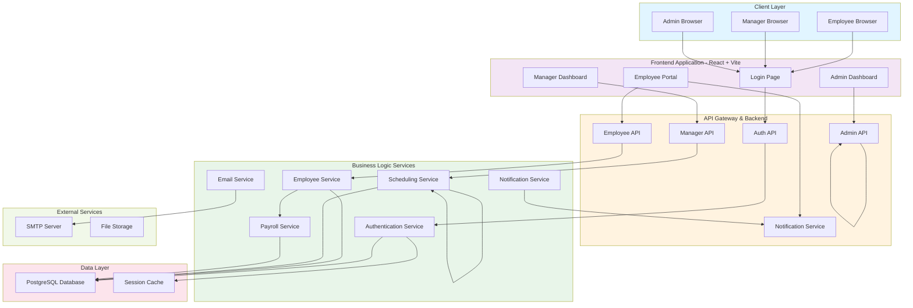

---

## 2. Database Entity Relationship Diagram (ERD)

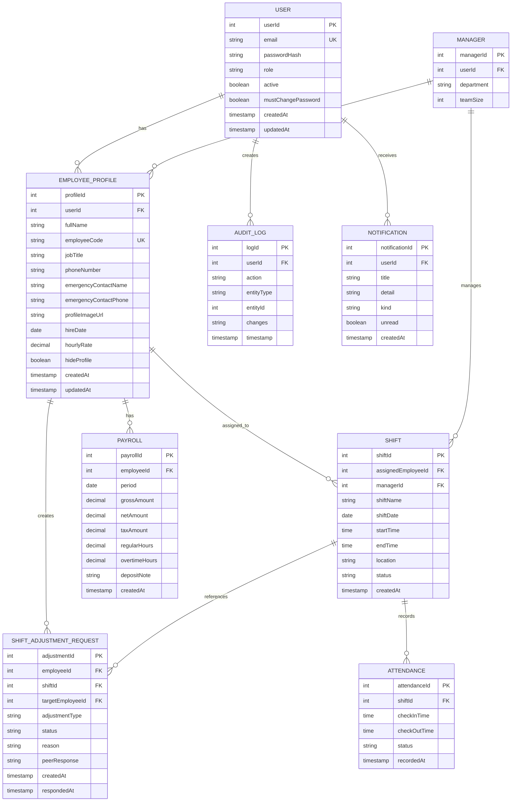

---

## 3. Authentication Flow

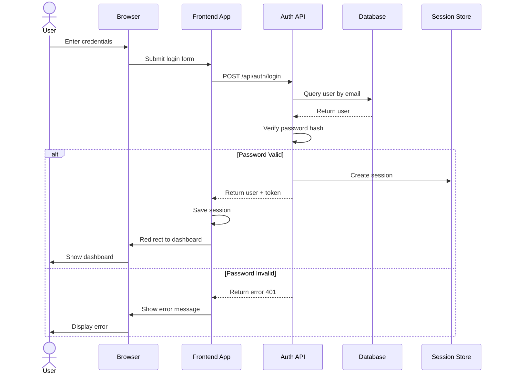

---

## 4. Employee Schedule & Adjustment Flow

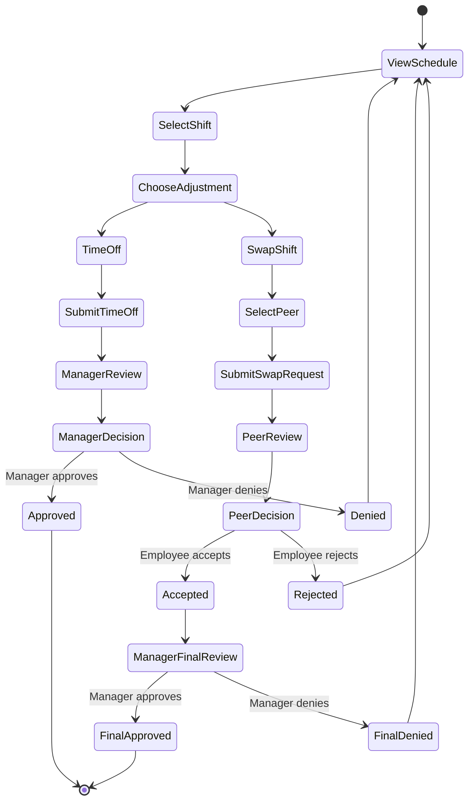

---

## 5. React Component Architecture

```mermaid
graph TB
    subgraph App["App.jsx - Main Router"]
        Router["React Router Setup"]
    end
    
    subgraph Auth["Auth Pages"]
        Login["login.jsx"]
    end
    
    subgraph Employee["Employee Portal"]
        Dashboard["employee_overview.jsx"]
        Schedule["my_schedule.jsx"]
        Earnings["earnings&pays.jsx"]
        Notifications["notifications.jsx"]
        Profile["profile.jsx"]
        Settings["personal_settings.jsx"]
    end
    
    subgraph Shared["Shared Components"]
        Bell["EmployeeNotificationBell.jsx"]
        ProfileMenu["EmployeeProfileMenu.jsx"]
        ThemeToggle["ThemeToggleButton.jsx"]
    end
    
    subgraph Lib["Utility Libraries"]
        API["api.js - HTTP Client"]
        Session["session.js - Storage"]
        Export["export.js - Export Tools"]
        Theme["theme-context.js"]
    end
    
    Router --> Login
    Router --> Dashboard
    Router --> Schedule
    Router --> Earnings
    Router --> Notifications
    Router --> Profile
    Router --> Settings
    
    Dashboard --> Bell
    Dashboard --> ProfileMenu
    Dashboard --> ThemeToggle
    Schedule --> Bell
    Schedule --> ProfileMenu
    Earnings --> Bell
    Earnings --> ProfileMenu
    Notifications --> Bell
    Notifications --> ProfileMenu
    Profile --> Bell
    Profile --> ProfileMenu
    Settings --> Bell
    Settings --> ProfileMenu
    
    Dashboard --> API
    Dashboard --> Session
    Schedule --> API
    Schedule --> Session
    Schedule --> Export
    Earnings --> API
    Earnings --> Export
    Notifications --> API
    Profile --> API
    Profile --> Session
    Settings --> API
    Settings --> Session
    
    Dashboard --> Theme
    Schedule --> Theme
    Earnings --> Theme
    Notifications --> Theme
    Profile --> Theme
    Settings --> Theme
    
    style App fill:#fff3e0
    style Auth fill:#f3e5f5
    style Employee fill:#e1f5ff
    style Shared fill:#e8f5e9
    style Lib fill:#fce4ec
```

---

## 6. API Endpoint Architecture

```mermaid
graph TB
    subgraph AuthAPI["Authentication API"]
        A1["POST /api/auth/login"]
        A2["POST /api/auth/change-password"]
        A3["GET /api/auth/validate"]
    end
    
    subgraph EmployeeAPI["Employee API"]
        E1["GET /api/employee/dashboard/:userId"]
        E2["GET /api/employee/schedule/:userId"]
        E3["GET /api/employee/earnings/:userId"]
        E4["GET /api/employee/notifications/:userId"]
        E5["GET /api/employee/profile/:userId"]
        E6["GET /api/employee/settings/:userId"]
        E7["POST /api/employee/adjustments/:userId"]
        E8["POST /api/employee/time-off/:userId"]
        E9["POST /api/employee/contact-manager/:userId"]
    end
    
    subgraph ManagerAPI["Manager API"]
        M1["GET /api/manager/dashboard"]
        M2["GET /api/manager/team/:managerId"]
        M3["POST /api/manager/schedule"]
        M4["GET /api/manager/reports"]
        M5["POST /api/manager/announcements"]
    end
    
    subgraph AdminAPI["Admin API"]
        D1["GET /api/admin/users"]
        D2["GET /api/admin/audit-logs"]
        D3["POST /api/admin/settings"]
    end
    
    subgraph Services["Backend Services"]
        AUTHSVC["AuthService"]
        EMPSVC["EmployeeService"]
        SCHDSVC["SchedulingService"]
        PAYRSVC["PayrollService"]
        NOTFSVC["NotificationService"]
    end
    
    A1 --> AUTHSVC
    A2 --> AUTHSVC
    A3 --> AUTHSVC
    
    E1 --> EMPSVC
    E2 --> SCHDSVC
    E3 --> PAYRSVC
    E4 --> NOTFSVC
    E5 --> EMPSVC
    E6 --> EMPSVC
    E7 --> SCHDSVC
    E8 --> SCHDSVC
    E9 --> NOTFSVC
    
    M1 --> EMPSVC
    M2 --> EMPSVC
    M3 --> SCHDSVC
    M4 --> EMPSVC
    M5 --> NOTFSVC
    
    D1 --> AUTHSVC
    D2 --> AUTHSVC
    D3 --> AUTHSVC
    
    style AuthAPI fill:#ffebee
    style EmployeeAPI fill:#e3f2fd
    style ManagerAPI fill:#f3e5f5
    style AdminAPI fill:#fff3e0
    style Services fill:#e8f5e9
```

---

## 7. Data Flow: Employee Schedule Update

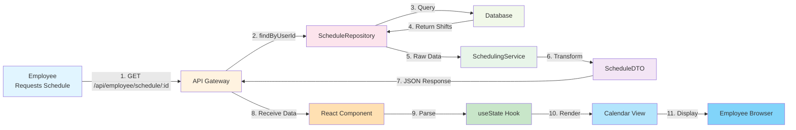

---

## 8. Deployment Architecture

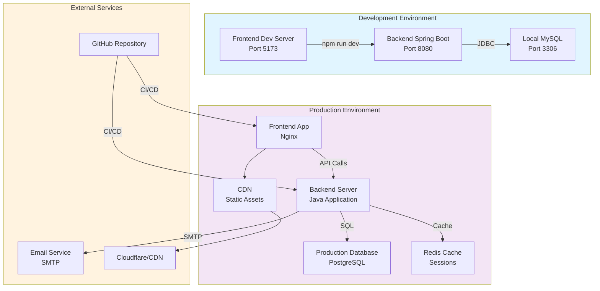

---

## 9. User Role & Permission Matrix

```mermaid
graph TB
    subgraph Permissions["Access Control"]
        EMP["EMPLOYEE<br/>━━━━━━━━━"]
        MGR["MANAGER<br/>━━━━━━━━━"]
        ADM["ADMIN<br/>━━━━━━━━━"]
    end
    
    subgraph Features["System Features"]
        F1["View Own Schedule"]
        F2["Request Time Off"]
        F3["Swap Shifts"]
        F4["View Earnings"]
        F5["Edit Profile"]
        F6["View Team Schedule"]
        F7["Manage Team"]
        F8["Create Schedules"]
        F9["Approve Adjustments"]
        F10["View Reports"]
        F11["Manage Users"]
        F12["System Settings"]
        F13["Audit Logs"]
        F14["Payroll Management"]
    end
    
    EMP --> F1
    EMP --> F2
    EMP --> F3
    EMP --> F4
    EMP --> F5
    
    MGR --> F1
    MGR --> F2
    MGR --> F3
    MGR --> F4
    MGR --> F5
    MGR --> F6
    MGR --> F7
    MGR --> F8
    MGR --> F9
    MGR --> F10
    MGR --> F14
    
    ADM --> F1
    ADM --> F2
    ADM --> F3
    ADM --> F4
    ADM --> F5
    ADM --> F6
    ADM --> F7
    ADM --> F8
    ADM --> F9
    ADM --> F10
    ADM --> F11
    ADM --> F12
    ADM --> F13
    ADM --> F14
    
    style Permissions fill:#f3e5f5
    style Features fill:#e3f2fd
    style EMP fill:#81c784
    style MGR fill:#64b5f6
    style ADM fill:#ff6e40
```

---

## 10. Request Response Lifecycle

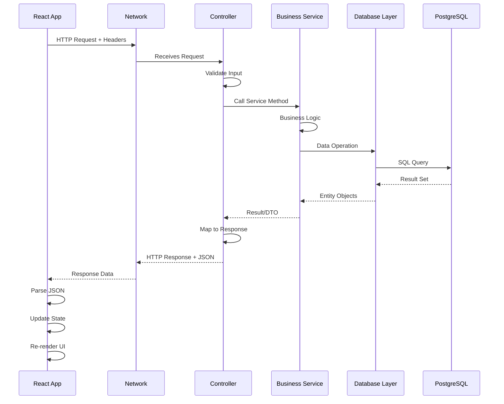

---

## 11. Technology Stack Diagram

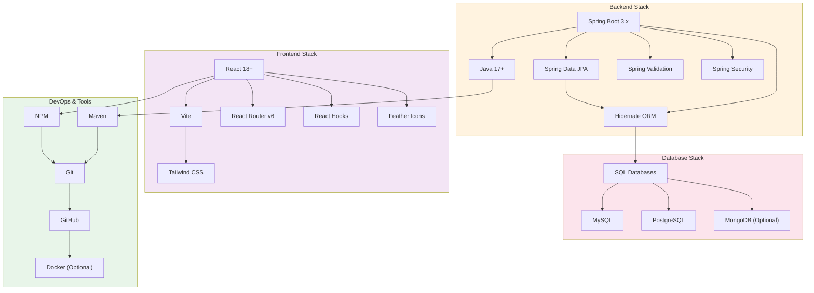

---

## 12. Session Management Flow

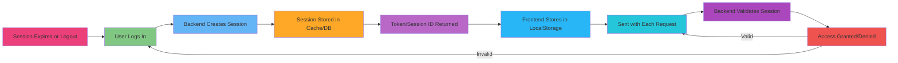

---

## Key Architectural Principles

### 1. **Separation of Concerns**
- Frontend handles UI/UX
- Backend handles business logic
- Database handles data persistence
- Services handle external integrations

### 2. **RESTful API Design**
- Standard HTTP methods (GET, POST, PUT, PATCH, DELETE)
- Resource-based endpoints
- JSON request/response format
- Proper HTTP status codes

### 3. **Security**
- Password hashing with bcrypt
- Session-based authentication
- Role-based access control (RBAC)
- Input validation on both frontend and backend
- CSRF protection

### 4. **Scalability**
- Stateless API design
- Caching strategies
- Database indexing
- Load balancing ready

### 5. **Maintainability**
- Clear code organization
- Consistent naming conventions
- Comprehensive documentation
- Modular component structure

### 6. **Performance**
- Frontend lazy loading
- Backend query optimization
- Caching mechanisms
- Efficient data serialization

---

## Database Scaling Strategy

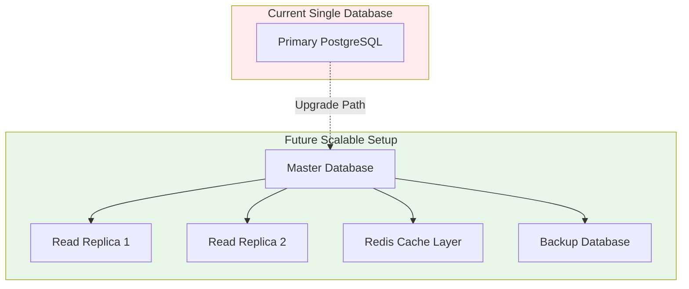

---

## Monitoring & Logging Strategy

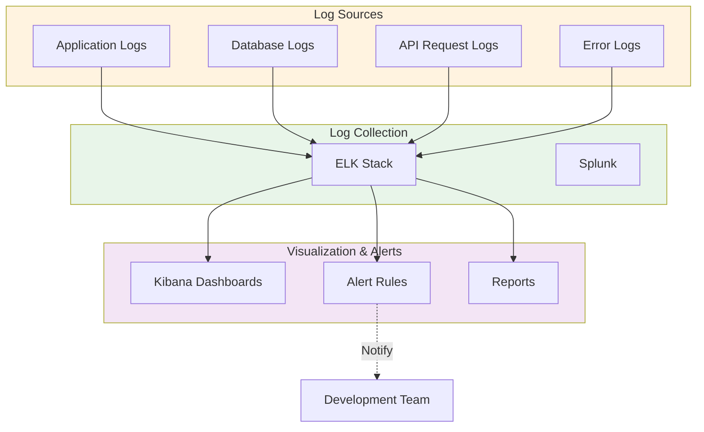

---

**Last Updated:** May 10, 2026
**Version:** 1.0.0

For more information, refer to the main [README.md](./README.md)
